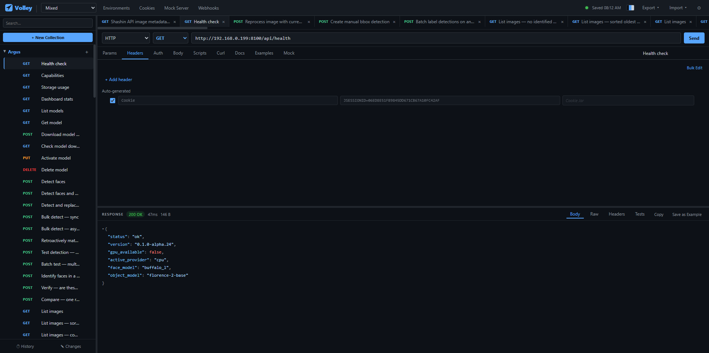

# Volley

> **AI-authored.** 100% of the code was written by Claude (Anthropic); I shaped the architecture, scope, and every decision, and did all the testing.



A fast, free, local-first HTTP client — the core Postman workflow you already know, without the account walls, forced cloud sync, telemetry, or subscription nags.

Volley is just a small Node server and some plain HTML/JS/CSS. Clone it, run one command, and you have a full-featured API client: collections and folders, environments and globals, OAuth2/JWT/Digest auth, pre-request and test scripts, a collection runner with CSV/JSON data-driven runs, a mock server, a cookie jar, and one-click cURL — all working offline, all stored as plain JSON files you fully own. Import your existing Postman collections and environments and you're up and running in minutes.

No npm install, no Docker, no sign-up, no rate limits, no paywalled "team" features. MIT licensed — use it, fork it, ship it.

## Running it

Volley needs its local server — it's what reads/writes `data/` and proxies outbound requests.

```bash
node server.js
```

Then open `http://localhost:5874`. No `npm install`, no dependencies — `server.js` only uses Node's standard library.

Prefer not to clone the repo? It's also published on npm:

```bash
npx @michaelyagi/volley
```

`npx` runs it from a temporary cache, so pass `--data-dir=<path>` (see below) to keep your collections in a permanent folder across runs — otherwise a fresh `npx` invocation may start from an empty `data/`.

To use a different port, pass `--port=<port>` (or set the `PORT` env var):

```bash
node server.js --port=3000
```

### Sharing `data/` (local-network sync)

By default Volley reads/writes `data/` next to `server.js`. Pass `--data-dir=<path>` (or set `VOLLEY_DATA_DIR`) to point it at a different folder — e.g. a Dropbox/Google Drive folder, a network share, or a separate git repo — so multiple machines or teammates can work from the same collections, environments, and history:

```bash
node server.js --data-dir=/path/to/shared/volley-data
```

There's no real-time sync or accounts — it's the same wipe-and-rewrite-on-save model described below, just pointed at a folder that something else (Dropbox, a sync tool, git) keeps in sync between machines. Avoid running two instances against the same `data/` at the same time, since the last save wins.

## Table of Contents

- [Features](#features)
- [Project structure](#project-structure)
- [Data storage (`data/`)](#data-storage-data)
  - [Request shape](#request-shape)
- [Environment variables](#environment-variables)
  - [Global variables](#global-variables)
  - [Saving response values as variables](#saving-response-values-as-variables)
- [Bulk Edit](#bulk-edit)
- [Auth types](#auth-types)
- [Realtime & streaming protocols](#realtime--streaming-protocols)
  - [Server-Sent Events (SSE)](#server-sent-events-sse)
  - [WebSocket](#websocket)
  - [MCP (Model Context Protocol)](#mcp-model-context-protocol)
- [Pre-request & Test Scripts](#pre-request--test-scripts)
  - [`pm` API](#pm-api)
- [Collection Runner](#collection-runner)
  - [Data-driven runs (CSV/JSON)](#data-driven-runs-csvjson)
- [CLI Runner](#cli-runner)
- [Monitors](#monitors)
- [Mock Server](#mock-server)
- [Cookie Jar](#cookie-jar)
- [Webhooks](#webhooks)
- [API Documentation](#api-documentation)
- [Tabs](#tabs)
- [Changes Panel](#changes-panel)
- [Export / Import](#export--import)
  - [Import cURL](#import-curl)
- [Git Sync (experimental)](#git-sync-experimental)
- [Log Viewer](#log-viewer)
- [Settings](#settings)
- [Tests](#tests)
- [No build step](#no-build-step)
- [License](#license)

## Features

- **Collections** — organise requests into collections and folders. Import Postman v2.x JSON, or Volley's own export format. Right-click a request to rename, duplicate, copy its URL, move it, or delete it; right-click a collection or folder to add requests/folders, run them, edit a description, rename, export, or delete.
- **Sidebar search & multi-select** — filter the sidebar by request name or URL as you type. `Ctrl`/`Cmd`-click or `Shift`-click to select multiple requests, then move or delete them all at once.
- **Drag-and-drop organization** — reorder requests and folders within a collection, move a request into a folder, or reorder collections and folders themselves by dragging their rows.
- **Multi-tab editing** — open several requests at once in browser-style tabs above the editor; each tab keeps its own edits, response, and active sub-tab.
- **Full request editing** — method, URL, query params, headers, auth, and body (raw JSON/XML/text, form-data with file uploads, x-www-form-urlencoded, raw binary, GraphQL)
- **Server-Sent Events (SSE)** — any response with `Content-Type: text/event-stream` switches the response panel to a live-updating event log instead of a single body. See [Server-Sent Events](#server-sent-events-sse).
- **WebSocket** — open a `ws://`/`wss://` URL to get a Connect/Disconnect button and a message transcript + composer instead of the usual send/response flow. See [WebSocket](#websocket).
- **MCP (Model Context Protocol)** — talk to an MCP server over Streamable HTTP or stdio, selected via the Protocol dropdown, with the `initialize` handshake handled automatically and a JSON-RPC transcript + composer. See [MCP](#mcp-model-context-protocol).
- **URL ↔ Params sync** — editing the URL's query string updates the Params table and vice versa, like Postman.
- **Path variables** — `:name` segments in the URL (e.g. `/users/:id`) show up as an editable "Path Variables" table on the Params tab; the names come from the URL, you fill in the values, and they're substituted in when the request is sent (and in the cURL preview).
- **Auto-generated headers preview** — the Headers tab shows a read-only "Auto-generated" section previewing the `Authorization`/API key header from the Auth tab, the `Content-Type` the Body tab will add, and any `Cookie` header the cookie jar will attach for this request's domain. A manual header that will be silently overridden by the Auth tab (e.g. a hand-typed `Authorization`) is highlighted with a warning.
- **Auth** — Bearer Token, Basic Auth, API Key, OAuth 2.0 (Client Credentials & Password Grant), Digest Auth, and JWT Bearer (HS256)
- **Environment variables** — `{{variable}}` placeholders are resolved from the active environment when sending. Switch environments from the topbar dropdown, or manage them via "Manage Env".
- **Global variables** — a "Globals" section in "Manage Env" holds variables that are available no matter which environment is active. `{{variable}}` placeholders fall back to a global when the active environment doesn't define that variable, and `pm.globals.get/set/unset` works the same way as `pm.environment.*` in scripts.
- **`{{variable}}` autocomplete** — type `{{` in the URL bar, any params/headers/form-data row, the raw body editor, or an auth field, and a dropdown suggests matching variable names from the active environment and globals. Filter by typing, navigate with the arrow keys, and accept with `Tab`/`Enter` (or click) to insert `{{varName}}`.
- **Save response values as variables** — hover any value in the response's JSON tree and click `→{{}}` to save it straight into the active environment.
- **Bulk edit** — click "Bulk Edit" above any params/headers/form-data/variables table to switch to a plain-text `name: value` editor (one per line, `// ` prefix to disable a row). Click "Form Edit" to switch back; edits are parsed back into rows, preserving each row's id/notes where the name matches.
- **Pre-request & test scripts** — run JavaScript before a request is sent or after its response arrives, via a small `pm`-style API. Extract values into environment/global variables, assert on the response with `pm.test`/`pm.expect`, and see pass/fail results in a "Tests" tab.
- **Collection Runner** — right-click a collection ("Run Collection") or a folder ("Run Folder") to send every request in it sequentially. Each request's pre-request/test scripts run as usual (sharing environment/global variables across the run, so values extracted by one request are available to the next), and results — status, timing, and test pass/fail counts — are shown live in a runner modal. Optionally attach a CSV or JSON data file before starting a run to repeat the whole run once per row, with each row's columns available as `{{variables}}` and via `pm.iterationData.get(key)`. Stop a run early with the "Stop" button.
- **CLI runner** — run a collection or folder from the command line with `node cli.js <collection> [folder]`, exiting non-zero on any error/4xx/5xx response or failed test — handy for CI/CD pipelines. See [CLI Runner](#cli-runner).
- **Monitors** — schedule a collection or folder to run automatically on an interval, right from the topbar's "Monitors" button — no external cron needed. Tracks pass/fail history per run. See [Monitors](#monitors).
- **Request & collection descriptions** — give any request or collection a free-text description (a request's "Docs" tab, or a collection's right-click "Edit Description") to document what it does for anyone else working in the same `data/` folder.
- **Comments** — leave timestamped, named comments on a request from its "Docs" tab — handy for leaving notes for teammates sharing the same `data/` folder.
- **Saved response Examples** — after sending a request, click "Save as Example" above the response body to snapshot its status/headers/body under a name. Saved examples live on the request's "Examples" tab — view one to load it back into the response viewer, or delete it.
- **Mock servers** — enable "Mock" on a request (its "Mock" tab) to define a canned status/headers/body/delay, then start the local mock server (topbar → "Mock Server") to serve every enabled mock on a chosen port. Routes are matched by method and path, with `:name` path segments matching anything (mirroring a request's `{{baseUrl}}/users/:id`-style URL).
- **Cookie jar** — `Set-Cookie` responses are stored automatically and replayed on later requests to matching domains. View or clear stored cookies from the "Cookies" topbar button.
- **Webhooks** — click "Webhooks" in the topbar to start a local listener that accepts any request on any method/path, always replies `200`, and logs what it received (method, path, headers, body, timestamp) — for seeing exactly what one local service sends another. See [Webhooks](#webhooks).
- **API Documentation** — a server-rendered `/docs` page documenting every collection's requests (method, URL, params, headers, auth type, body, saved examples), always current since it reads straight from saved data — no separate "publish" step. Credentials are redacted. See [API Documentation](#api-documentation).
- **Response viewer** — status, timing, size, collapsible JSON tree, raw body, response headers. The JSON tree is virtualized (only visible rows are in the DOM) and parsed off the main thread in a Web Worker, so large responses stay fast to render and scroll without freezing the tab.
- **cURL** — every request shows a live curl command that updates as you edit, with one-click copy. Click **Edit** to edit the curl directly — change the method, URL, headers, or body in curl syntax and **Save** to apply it back to the request fields. **Import cURL** (under **Import ▾**) accepts one or many curl commands at once: paste a block or a whole bash script, and Volley creates the requests for you. See [Import cURL](#import-curl).
- **Notes on params/headers** — annotate individual rows ("Dev key", "pagination cursor", etc.)
- **Request history** — every sent request logged with method, status, and timing; click to replay
- **Changes panel** — click "✎ Changes" in the sidebar to see every request you've edited since the app loaded (or since the last Git Sync pull), grouped by collection, with a field-by-field diff and a one-click Reset per request or for everything at once. See [Changes Panel](#changes-panel).
- **Per-request tab memory** — remembers which tab (Params/Headers/Auth/Body/cURL) you last had open for each request
- **CORS handling** — Volley tries a direct `fetch()` first; if the browser blocks it (CORS), the request is automatically retried through the local Node server, where CORS doesn't apply. SSE and Digest Auth always go through the server.
- **Server status indicator** — a dot in the topbar shows whether the local server is reachable; coordinates across browser tabs via `BroadcastChannel` so only one tab polls at a time.
- **Color themes** — pick Dark, Light, Nord, Carnival, or Garbagefire from the topbar theme picker; your choice is remembered per device.
- **Git sync** *(experimental, enable in Settings)* — push and pull your collections against a remote git repository. See [Git Sync](#git-sync-experimental).
- **Log viewer** *(enable in Settings)* — a Logs button opens a live-streaming view of server output, replaying a configurable in-memory buffer of recent lines. See [Log Viewer](#log-viewer).
- **Responsive layout** — on narrow/tablet/phone widths, the sidebar collapses behind a `☰` toggle and slides over the request panel.
- **Export / Import** — the **Export ▾** dropdown exports everything as Volley JSON, as Postman v2.1 (one file per collection), or as a bash-compatible cURL commands file. Individual collections can also be exported via right-click. The **Import ▾** dropdown accepts a local Volley/Postman file, a URL, or pasted curl commands (**Import cURL**). See [Export / Import](#export--import).
- **Auto-save** — every change is saved to disk automatically (debounced), with a save-status indicator in the topbar. `Ctrl+S`/`Cmd+S` still works for an explicit save.
- **About** — click the Volley logo/title in the topbar for an About modal with a short description and the MIT license text.

## Project structure

```
volley/
├── server.js               — stdlib-only Node server: static files + API endpoints
├── cli.js                  — headless Collection Runner (CI/CD), see [CLI Runner](#cli-runner)
├── lib/
│   └── headless-runner.js  — shared headless-run core (vm sandbox + request runner), used by cli.js and server.js's Monitors scheduler
├── data/                   — gitignored; your collections, environments, history, and globals (plain JSON)
├── config/                 — gitignored; server-side config (git.json, logs.json)
├── volley-sync/             — gitignored; local git clone managed by Git Sync
├── index.html              — markup only, no inline JS or CSS
├── css/
│   ├── base.css            — reset, layout shell, form controls, buttons, tabs, spinner
│   ├── themes.css          — Dark/Light/Nord/Carnival/Garbagefire theme variable sets
│   ├── sidebar.css         — sidebar, resizer, collection/folder/request rows, context menu
│   ├── request.css         — URL bar, KV editor, auth editor, body editor, bulk edit
│   ├── response.css        — response panel, status badge, JSON tree, SSE event log, WebSocket transcript, MCP composer, history panel
│   └── modals.css          — modal backdrop, environment modal, runner modal, git modal, log viewer, settings, toast notifications
└── js/
    ├── state.js            — global state, auto-save scheduling, shared utilities
    ├── theme.js            — color theme picker
    ├── tabs.js             — open-request tab strip
    ├── sidebar.js          — sidebar rendering, search, context menus
    ├── curl.js             — curl command generation
    ├── request.js          — request editor: tabs, KV/auth/body editors, bulk edit
    ├── response.js         — response panel rendering, virtualized DOM-based JSON tree, SSE/WebSocket/MCP transcripts
    ├── json-worker.js      — Web Worker: parses/pretty-prints large JSON response bodies off the main thread
    ├── send.js             — request execution (direct fetch → proxy fallback), response parsing, SSE, OAuth2
    ├── websocket.js        — WebSocket client (ws://, wss://), relayed through the local server
    ├── mcp.js              — MCP client (Streamable HTTP and stdio transports, via req.protocol)
    ├── collections.js      — collection/folder/request CRUD, Postman & Volley import/export, URL import
    ├── modals.js           — environment & global variables modal
    ├── runner.js           — Collection Runner (run a collection/folder, CSV/JSON data files, results modal)
    ├── mock.js             — Mock Server modal (build routes from requests with mocking enabled, start/stop)
    ├── webhooks.js         — Webhooks modal (local request-capture listener, start/stop, log)
    ├── monitors.js         — Monitors modal (CRUD + run history over server.js's /api/monitors*)
    ├── settings.js         — Settings modal, feature flags (stored in localStorage)
    ├── logs.js             — Log viewer modal, SSE stream from /api/logs/stream
    ├── git.js              — Git Sync modal: push/pull/conflict resolution/auto-sync
    └── app.js              — init, sidebar resizer, history panel, save/load, server status polling
```

All JS files share the global scope and load in order. `state.js` must be first — everything else depends on it. `app.js` is last and calls `init()` to boot.

## Data storage (`data/`)

`data/` is gitignored — it holds your local collections, environments, and history as plain JSON files. Each machine running Volley has its own independent `data/` folder; there is no cloud sync and no shared state between computers. To move collections between machines, use [Export / Import](#export--import) — export on one machine and import on another. For continuous sharing, see [Sharing `data/`](#sharing-data-local-network-sync).

- **Collections are directories**: `data/<Collection Name>/`
- **Requests are files**: `data/<Collection Name>/<Request Name>.json`
- **Folders are not directories** — a request inside a Postman-style folder just has an extra `"folder": "<Folder Name>"` field; the layout on disk is always flat, one level deep.
- **Environments, globals, history, open tabs, and cookies**: `data/_volley/envs.json`, `data/_volley/globals.json`, `data/_volley/history.json`, `data/_volley/tabs.json`, and `data/_volley/cookies.json`
- **Monitors**: definitions in `data/_volley/monitors.json`, run history in `data/_volley/monitor-runs.json` — see [Monitors](#monitors)

### Request shape

```json
{
  "name": "Get user",
  "method": "GET",
  "url": "https://api.example.com/users/:userId",
  "protocol": "http",
  "description": "Fetches a single user by id.",
  "params":  [{ "id": "x", "key": "include", "value": "profile", "enabled": true, "note": "" }],
  "pathVars": [{ "id": "z", "key": "userId", "value": "123" }],
  "headers": [{ "id": "y", "key": "Authorization", "value": "Bearer {{token}}", "enabled": true, "note": "Dev key" }],
  "body": {
    "type": "raw",
    "raw": "{\"key\": \"value\"}",
    "contentType": "json",
    "formData": [],
    "graphql": { "query": "", "variables": "" }
  },
  "auth": {
    "type": "bearer",
    "token": "{{token}}",
    "username": "", "password": "", "apiKey": "", "apiValue": "",
    "accessTokenUrl": "", "clientId": "", "clientSecret": "", "scope": "",
    "cachedToken": "", "cachedExpiry": 0,
    "jwtSecret": "", "jwtPayload": "{\"sub\":\"user123\"}"
  },
  "preRequestScript": "pm.environment.set('timestamp', Date.now());",
  "testScript": "pm.test('status is 200', () => pm.expect(pm.response.status).toBe(200));",
  "comments": [{ "id": "c1", "author": "Alice", "text": "Returns 404 for soft-deleted users.", "createdAt": 1718000000000 }],
  "mock": { "enabled": false, "status": 200, "headers": [], "body": "{\"id\":123,\"name\":\"Ada\"}", "delay": 0 },
  "examples": [{ "id": "e1", "name": "200 OK", "status": 200, "statusText": "OK", "headers": {}, "body": "{\"id\":123}", "bodyType": "json", "createdAt": 1718000000000 }]
}
```

Collections also carry a `"description"` field, set via right-click → "Edit Description" on a collection.

A form-data body's `formData` rows can be files instead of plain text values, and a `"binary"` body type sends a raw file as the request body:

```json
{
  "body": {
    "type": "formdata",
    "formData": [
      { "id": "a", "key": "name",   "value": "volley",  "enabled": true, "type": "text" },
      { "id": "b", "key": "upload", "enabled": true,   "type": "file", "fileName": "photo.png", "fileSize": 12345, "fileMimeType": "image/png", "fileData": "<base64>" }
    ]
  }
}
```

```json
{
  "body": {
    "type": "binary",
    "fileName": "report.pdf", "fileSize": 98765, "binaryMimeType": "application/pdf", "fileData": "<base64>"
  }
}
```

File contents (`fileData`) are stored as base64 in the request's saved JSON, sent to the server as part of `/api/proxy`'s body, and reassembled into a multipart `Blob`/raw `Buffer` server-side.

A `"graphql"` body type sends a `POST` (or whatever method the request uses) with a JSON body of `{ "query": ..., "variables": ... }`, and adds a `Content-Type: application/json` header automatically (unless you've set your own or disabled it):

```json
{
  "body": {
    "type": "graphql",
    "graphql": {
      "query": "query GetUser($id: ID!) { user(id: $id) { id name } }",
      "variables": "{\"id\": \"{{userId}}\"}"
    }
  }
}
```

Both `query` and `variables` support `{{variable}}` interpolation; `variables` is parsed as JSON when the request is sent.

## Environment variables

Use `{{variable}}` placeholders anywhere in a request's URL, params, headers, or body — they're resolved against the **active environment** when the request is sent.

1. Click **Manage Env** in the topbar to open the environment editor.
2. Add a variable, e.g. `baseUrl` = `https://api.example.com` and `token` = `your-dev-token`.
3. Pick that environment from the dropdown next to **Manage Env**.
4. In a request, set the URL to `{{baseUrl}}/users/{{userId}}` and add a header `Authorization: Bearer {{token}}`.

`{{userId}}` would come from another environment variable, or you can leave params un-interpolated for ones you fill in per-request. Switching environments from the topbar dropdown instantly changes what every `{{...}}` placeholder resolves to — handy for flipping between dev/staging/prod without editing requests.

### Global variables

The **Globals** entry in **Manage Env** (above your list of environments) holds variables that aren't tied to any one environment. When a `{{variable}}` placeholder isn't found in the active environment, Volley falls back to a matching global variable before leaving it un-interpolated. Use globals for values that are the same everywhere (an API key, a shared account id) so you don't have to duplicate them into every environment.

### Saving response values as variables

After sending a request, expand the JSON tree in the response viewer and hover over any leaf value (string, number, boolean, null). A `→{{}}` button appears — click it to save that value into the active environment under a variable name you choose. The same thing can be done from a test script with `pm.environment.set(...)` (see below).

## Bulk Edit

Every params/headers/form-data/variables table has a **Bulk Edit** button above it. Click it to switch to a plain-text editor with one `name: value` pair per line — handy for pasting in a block of headers or query params at once. Prefix a line with `// ` to add it as a disabled row. Click **Form Edit** to switch back to the table view; rows are matched back to their previous id/notes by name where possible.

## Auth types

Configure auth on the **Auth** tab of a request. Volley supports:

- **Bearer Token** — sets `Authorization: Bearer <token>`. Token field supports `{{variables}}`.
- **Basic Auth** — sets `Authorization: Basic <base64(username:password)>`.
- **API Key** — adds a custom header (or query param) with a key/value you choose.
- **OAuth 2.0 — Client Credentials** — set **Access Token URL**, **Client ID**, **Client Secret**, and optionally **Scope**. Click **Get Access Token** to fetch and cache a token, or just hit Send — Volley fetches one automatically if none is cached (or the cached one has expired).
- **OAuth 2.0 — Password Grant** — same as above, plus **Username**/**Password**, sent with `grant_type=password`.
- **OAuth 2.0 — Authorization Code** — set **Authorization URL**, **Access Token URL**, **Client ID**, and (optionally, if not using PKCE) **Client Secret**. Click **Get Access Token** (or hit Send) to open the provider's login page in a popup; Volley's local server handles the `/api/oauth/callback` redirect, exchanges the code for a token (with PKCE by default), and caches it like the other OAuth2 grants.
- **Digest Auth** — set **Username**/**Password**. Volley sends the request, and if the server responds with a `WWW-Authenticate: Digest` challenge, transparently retries with the computed digest response — no manual nonce handling needed.
- **JWT Bearer (HS256)** — set a **Secret** and a JSON **payload** (e.g. `{"sub":"user123"}`). Volley signs a fresh HS256 JWT at send time, adding `iat`/`exp` (1 hour) automatically if you don't specify them, and sends it as `Authorization: Bearer <jwt>`.

For OAuth2, the fetched token is cached on the request (`cachedToken`/`cachedExpiry`) and reused until it expires. The resulting `Authorization: Bearer <token>` header is shown read-only under "Auto-generated" on the Headers tab (uncheck it there to omit it from the request).

## Realtime & streaming protocols

In addition to plain HTTP, the URL scheme determines whether a request is sent normally or switches the editor into a persistent-session mode with its own response panel.

### Server-Sent Events (SSE)

No special URL scheme needed — send a request as normal (`GET` or otherwise) to an endpoint that responds with `Content-Type: text/event-stream`. Volley detects this and switches the response panel to a live-updating event log instead of a single body: each event shows its `event`/`id`/`retry` fields, the raw `data`, and the time it was received. Click **Cancel** (shown in place of Send while connected) to close the stream.

### WebSocket

Set the request URL to `ws://` or `wss://`. The Send button becomes **Connect** — click it to open a relayed WebSocket connection (proxied through Volley's local server, so there's no browser CORS/origin restriction). Once connected:

- The response panel shows a transcript of sent and received messages with timestamps.
- A composer at the bottom lets you type a message and send it over the open connection.
- The button becomes **Disconnect** — click it, or close the tab, to close the connection.

Headers and auth configured on the request (e.g. a `Sec-WebSocket-Protocol` or `Authorization` header) are sent with the initial handshake.

### MCP (Model Context Protocol)

Volley includes a small built-in MCP client for talking to MCP servers directly from a request tab. Pick the transport from the **Protocol** dropdown in the URL bar:

- **MCP · Streamable HTTP** — enter the server's endpoint as a normal URL (e.g. `https://mcp.deepwiki.com/mcp`). It's proxied server-side via the same mechanism as a normal request (no CORS issues).
- **MCP · stdio** — the URL field becomes a command line (e.g. `npx -y @some/mcp-server`). Volley spawns that command as a local child process and speaks newline-delimited JSON-RPC over its stdin/stdout.

Either way, click **Connect** to perform the `initialize` handshake (Volley sends `initialize` then `notifications/initialized` automatically). Once connected:

- The response panel shows the JSON-RPC message transcript (sent and received), plus the connected server's name/version once known.
- A composer lets you pick a method (autocompleted from common MCP methods like `tools/list`, `tools/call`, `resources/list`, `resources/read`, `prompts/list`, `prompts/get`) and supply a JSON `params` object, then send it as a new JSON-RPC request. Volley wraps your method/params in the full `{"jsonrpc":"2.0","id":<auto>,...}` envelope.
- Click **Disconnect**, or close the tab, to end the session.

For example, after `tools/list` shows you a tool's name and input schema, call it with `tools/call` and a params object like:

```json
{
  "name": "read_wiki_contents",
  "arguments": { "repoName": "owner/repo" }
}
```

If you've scrolled up in the transcript, new messages arrive without yanking your scroll position — a "New response ↓" banner appears until you scroll to (or click it to jump to) the bottom.

## Pre-request & Test Scripts

Each request has a **Scripts** tab with two editors: a **pre-request script**, run just before the request is sent, and a **test script**, run after the response arrives. Both are plain JavaScript with access to a small `pm` object, similar to Postman's sandbox.

### `pm` API

- `pm.environment.get(key)` — read a variable from the active environment
- `pm.environment.set(key, value)` — create or update a variable in the active environment
- `pm.environment.unset(key)` — remove a variable
- `pm.globals.get(key)` / `pm.globals.set(key, value)` / `pm.globals.unset(key)` — same, but for [global variables](#global-variables) (always accessible regardless of active environment)
- `pm.iterationData.get(key)` — read a column from the attached data file; always returns `undefined` outside a [data-driven run](#data-driven-runs-csvjson) (read-only)
- `pm.response.status` / `pm.response.statusText` — response status (test scripts only)
- `pm.response.headers` — response headers object (test scripts only)
- `pm.response.responseTime` — elapsed time in ms (test scripts only)
- `pm.response.json()` — parse the response body as JSON (test scripts only)
- `pm.response.text()` — raw response body as a string (test scripts only)
- `pm.test(name, fn)` — register a named test; `fn` throwing marks it failed
- `pm.expect(value)` — chainable matchers: `.toBe()`, `.toEqual()`, `.toBeTruthy()`, `.toBeFalsy()`, `.toBeDefined()`, `.toBeNull()`, `.toContain()`, `.toHaveProperty()`, `.toBeGreaterThan()`, `.toBeLessThan()`, plus `.not` to negate any of them

### Example: pre-request script

Set a fresh timestamp on every send:

```js
pm.environment.set('timestamp', Date.now());
```

### Example: test script

Assert on the response and pull a value into an environment variable for later requests:

```js
pm.test('status is 200', () => {
  pm.expect(pm.response.status).toBe(200);
});

pm.test('response is not an error', () => {
  pm.expect(pm.response.json()).not.toHaveProperty('error');
});

pm.environment.set('userId', pm.response.json().id);
```

Test results show up in a **Tests** tab in the response panel, with a pass/fail count badge. Scripts that throw outside of `pm.test()` (a syntax error, etc.) show up as a single failed test.

## Collection Runner

Right-click a collection and choose **Run Collection** (or right-click a folder and choose **Run Folder**) to send every request in it, one after another. Each request runs the same way it would from its tab — pre-request script, send, test script — except nothing happens in the UI; instead a runner modal shows live results: method, name, status (or error), response time, and a `passed/total tests` badge for any test scripts.

Pre-request and test scripts share the same active environment and globals across the whole run, so a value extracted by `pm.environment.set(...)` (or `pm.globals.set(...)`) in one request's test script is available to later requests' pre-request scripts — useful for chains like "log in, then use the returned token for the rest of the requests in the collection". Click **Stop** to end the run after the current request finishes.

### Data-driven runs (CSV/JSON)

Before clicking **Start Run**, optionally choose a `.csv` or `.json` data file:

- **CSV** — the first row is treated as headers; every other row becomes a data row, one column per header.
- **JSON** — must be an array of objects; each object becomes a data row.

When a data file is attached, the whole run repeats once per row. While a row is active, its columns take priority over environment/global variables for `{{variable}}` interpolation, and are also readable from scripts via `pm.iterationData.get('columnName')`. Each result in the runner modal is tagged with its iteration number when running with data.

## CLI Runner

`cli.js` runs the same Collection Runner logic from the command line, without a browser — useful for CI/CD pipelines.

```bash
node cli.js <collection> [folder] [options]
```

- `<collection>` — name of the collection to run (required)
- `[folder]` — name of a folder within that collection to run instead of the whole collection (optional)

Options:

- `--env <name>` — use this environment (by name) instead of the active one
- `--data <file>` — a CSV/JSON data file for a [data-driven run](#data-driven-runs-csvjson)
- `--data-dir <dir>` — same as `server.js`'s `--data-dir`, defaults to `./data`

```bash
node cli.js "My API" --env Staging --data rows.csv
```

For each request, prints its method, name, status (or error), and elapsed time, plus `PASS`/`FAIL` lines for any test scripts, followed by a summary line. The process exits with code `1` if any request errored or returned a 4xx/5xx response, or if any test failed — `0` otherwise.

## Monitors

A monitor is a saved "run this collection/folder on a schedule" definition, executed by the running `server.js` process itself — no external cron, and no browser tab needs to stay open. It reuses the exact same headless run logic as [`cli.js`](#cli-runner) (`lib/headless-runner.js`), invoked in-process against the server's own port on an interval.

Click **Monitors** in the topbar to open the modal:

1. Click **+ New Monitor**, give it a name, and pick a **Collection** (and optionally a **Folder** to run instead of the whole collection).
2. Optionally pick an **Environment** — leave it on "Active environment" to always use whatever's currently selected in the topbar.
3. Set the **Interval (minutes)** and make sure **Enabled** is checked, then click **Create**.
4. Click **Run Now** at any time for an immediate run without waiting for the schedule.

Each monitor keeps its most recent runs (status, elapsed time, requests/tests passed) under **Recent runs** in its detail panel, and a colored dot next to its name in the list shows the outcome of its last run at a glance (green = passed, red = failed, grey = never run). A dot also lights up on the topbar **Monitors** button whenever any enabled monitor's last run failed.

Monitor definitions live in `data/_volley/monitors.json` and sync via [Git Sync](#git-sync-experimental) like any other collection config; run history lives in `data/_volley/monitor-runs.json` and is excluded from sync, same as request history — see [Data storage](#data-storage-data).

## Mock Server

Any request can act as a mock: open its **Mock** tab, check **Enable mock response for this request**, and set a status code, headers, delay (ms), and a response body. The tab shows the method + path (derived from the request's URL — `{{var}}` prefixes, host, and query string are stripped, e.g. `{{baseUrl}}/users/:id?x=1` → `/users/:id`) that the mock server will answer for.

Click **Mock Server** in the topbar to open the mock modal, which lists every request with mocking enabled across all collections. Pick a port (default `5875`) and click **Start** to launch a local HTTP server that answers each enabled mock at its method + path — `:name` path segments match any value, so `/users/:id` matches `/users/42`. Headers and body support `{{variable}}` interpolation against the active environment/globals. Click **Stop** to shut it down. Useful for developing a frontend against an API that doesn't exist yet, or for demoing without a live backend.

The route list is a snapshot taken when you click **Start** — if you enable/edit a mock while the server is already running, click **Stop** then **Start** again to pick it up.

Matching is **method + path only** — incoming request headers, query strings, auth, and body are not checked, so any request to a matching method/path gets the same mocked response. The headers configured on the Mock tab are *response* headers (sent back with the reply, e.g. a custom `Content-Type`), not a requirement on the incoming request.

## Cookie Jar

Volley keeps a server-side cookie jar at `data/_volley/cookies.json`. Whenever a response includes `Set-Cookie` headers, the cookies are parsed and stored automatically; on later requests, any stored cookie whose domain, path, expiry, and `Secure` flag match the request URL is sent back in the `Cookie` header — no manual copying of session cookies between requests.

Click **Cookies** in the topbar to open the cookie jar modal, where you can see every stored cookie's name, value, domain/path, and expiry, delete individual cookies, or clear the jar entirely.

Any cookie that would be attached to the current request also shows up as a read-only `Cookie` row in the Headers tab's "Auto-generated" section, so you can see exactly what will be sent.

## Webhooks

Click **Webhooks** in the topbar to open a listener for testing one local service calling another — point whatever sends the real webhook at Volley first to see exactly what it sends before wiring it into the real destination.

1. Set a **Port** (default `5876`) and click **Start**. Volley spawns a local HTTP server that accepts any method/path and always replies `200`.
2. Point the sending service at `http://localhost:<port>` (or `http://<this machine's LAN IP>:<port>` for a sender on another device — `localhost` only ever means "this same machine").
3. Each captured request appears in the list (method, path, time) as it arrives — the modal polls while open, so nothing needs a manual refresh. Click one to see its headers and body.

Click **Clear** to wipe the log, or **Stop** to shut the listener down. A dot on the topbar **Webhooks** button shows when it's running.

Running inside **WSL2**? WSL2 only forwards `localhost` traffic from Windows into WSL2 — it doesn't expose WSL2's ports to your LAN by default, so a sender on another device won't reach the listener until you enable mirrored networking (Windows 11 22H2+) or add a manual `netsh` port forward. The in-app "Sender on another device? Read this first" note walks through both.

## API Documentation

`GET /docs` renders a static, self-contained HTML page documenting every collection — a lightweight alternative to Postman's published documentation. It's built server-side straight from saved `data/` state (not the browser's possibly-unsaved editor state), so there's no separate "publish" step and it's always current — just open it.

Click **Docs** in the topbar to open it in a new tab. For each collection you get a table of contents plus, per request: method, URL, description, params, headers, auth type, body, and any saved [Examples](#saved-response-examples). Want a standalone file instead — to host on GitHub Pages, S3, or share directly — use **Export ▾ → Documentation (HTML)**, which downloads the same page as `volley-docs.html`. To share the live page with someone outside your machine, point a tunnel (e.g. `cloudflared tunnel --url http://localhost:5874`) at your running Volley instance.

**Credentials are redacted.** The `Authorization` and `Cookie` header values, and every field on the Auth tab (tokens, passwords, client secrets, API keys), never appear — only the auth *type* is shown (e.g. "Bearer Token"). Everything else — including other header values, params, and the body — renders exactly as stored, same as Volley's other export formats. A hand-typed secret in some other header or in the body is **not** redacted; keep real secrets in `{{environment variables}}`, which are never part of a collection and so never appear in the generated docs.

## Tabs

Opening a request from the sidebar opens it in a new tab (or focuses its existing tab if already open). Each tab keeps its own unsaved edits, response, and active sub-tab (Params/Headers/Auth/Body/cURL), so you can work on multiple requests side by side. Close a tab with its `×` button; closing the last tab returns to the "Select or create a request" empty state.

## Changes Panel

Click **✎ Changes** at the bottom of the sidebar to see every request that's been edited since a baseline snapshot was taken — on app load, and again after a Git Sync pull is applied — grouped by collection. A badge on the button shows how many requests have changed.

Each entry shows a field-by-field diff: renamed/moved fields (name, method, URL) show old → new; params/headers/form-data show added/removed/changed/toggled rows; scripts, mock settings, description, and examples show a short note when they differ (their full content isn't diffed inline). Auth changes are flagged as "credentials modified" without showing the actual old/new secret values.

Per request:

- **Open** — jump to that request's tab.
- **Reset** — revert just that request back to its snapshot.

Or **Reset All** (top of the panel) to revert every changed request at once. Auto-save still runs as normal while the panel is open — a reset is itself a change that gets saved to disk like any other edit. Note this tracks changes *within the current session* (or since the last pull), not "unsaved to disk" — Volley auto-saves within a second of any edit, so there's no separate saved/unsaved distinction to show here.

## Export / Import

The **Export ▾** dropdown (topbar) offers three formats:

- **Volley** — downloads `volley-export.json` containing all collections, folders, requests, and environments. This is the format [Import](#export--import) expects for the full round-trip. History is excluded — it's local clutter, not something worth sharing.
- **Postman v2.1** — downloads one `.postman_collection.json` file per collection (one download per collection). Useful for sharing with teammates on Postman.
- **cURL commands** — downloads `volley-export.sh`, a bash-compatible text file with every request rendered as a named `curl` command. `{{variable}}` placeholders are preserved as-is. Requests are grouped by collection, with folder membership noted in the name (`# Folder / Request`). This file can be pasted straight back into **Import ▾ → Import cURL** to recreate the requests.

A single collection can also be exported on its own via its right-click menu, as either a Volley JSON file (**Export JSON**) or a Postman v2.1.0 collection (**Export as Postman**) — handy for sharing one collection without exporting everything.

The **Import ▾** dropdown offers three ways to get data in:

- **From file** — pick a local `.json` file
- **From URL** — enter a URL; Volley's server fetches it (so CORS and auth headers on the remote server are not an obstacle) and feeds the result into the same import pipeline
- **Import cURL** — paste curl commands directly; see [Import cURL](#import-curl) below

From file and From URL accept:
- A Volley export (`{ "cols": [...], "envs": [...] }`) — opens an **import preview modal** before anything is applied (see below)
- A Postman v2.x collection — added as a new collection; any collection-level Postman variables are imported as an environment named after the collection
- A Postman environment export — merged into a matching (or newly created) environment by name; new vars are added and changed vars are updated

### Volley import preview

When importing a Volley export, a preview modal lists every request that would change, grouped by collection, before anything is written:

- **New** — the request doesn't exist locally; will be added
- **Changed** — the request exists but differs from the imported version; will replace the local copy
- **Identical** — not shown; silently skipped

Every item is checked by default. Uncheck any you want to leave as-is, then click **Import** to apply. **Cancel** closes the modal with no changes made.

The **Overwrite all** checkbox at the top checks every item at once — useful when you want to fully sync from the exported file without reviewing individual requests.

Environment variables in the export are always synced automatically (new vars added, changed vars updated, identical vars skipped) regardless of which requests you check.

## Import cURL

**Import ▾ → Import cURL** creates one or more requests from curl commands you paste in.

1. Pick a collection from the dropdown — existing collections are listed; choose **New collection…** to create one.
2. Paste curl commands into the textarea.
3. Click **Preview** to see what will be imported.
4. Click **Import** to add the requests.

**Format** — the importer is designed to accept a raw paste with no special formatting required:

- Multiple curl commands can be separated by blank lines, placed back-to-back with no separator, or separated only by a `# comment` — all three work.
- A `# Name` comment immediately before a curl becomes that request's name. This is bash-compatible: pasting a real bash script with `# comment` lines before each curl works naturally.
- Shebangs (`#!/bin/bash`), variable assignments, `echo` calls, and other non-curl lines are silently skipped.
- When no `# comment` is present, the request is named from the URL: the path (`/v2/users/search`) for non-root URLs, or the hostname without `www.` (`api.example.com`, `localhost:8100`) for root URLs.
- Duplicate names within the target collection are auto-suffixed (` (2)`, ` (3)`, …).

**Merging** — if the chosen collection already exists, the imported requests are added to it. If not, a new collection is created at the top of the sidebar.

**Shell variables** (`$TOKEN`, `${BASE_URL}`) appear as literals in the imported request — they're not resolved. Replace them with Volley `{{variables}}` or literal values after import.

The **Edit** button on the cURL tab of any imported request lets you edit the curl directly and save it back to the request fields — so importing a curl is just the starting point, not a one-time migration.

## Git Sync (experimental)

Git Sync lets you push and pull your collections against a remote git repository you own — a private GitHub repo, a self-hosted Gitea instance, anything with an HTTPS git remote. Your `data/` folder is never itself a git repo; instead Volley maintains a separate local clone (`volley-sync/`) as a bridge.

Enable it first in **⚙ Settings → Experimental → Git sync**, then click the **Git** button that appears in the topbar.

### Setup

1. **Remote URL** — the HTTPS URL of your collections repo (e.g. `https://github.com/you/my-collections`).
2. **Personal Access Token** — required for private repos and for push. For GitHub fine-grained PATs: grant **Contents (read & write)** and **Metadata (read)**. Leave blank for a public read-only repo.
3. **Branch** — defaults to `main`.
4. Click **Save**, then **Connect** to clone the remote into `volley-sync/` and populate `data/` from it.

### Push / Pull

- **Push** — copies `data/` into `volley-sync/`, commits, and pushes to the remote. Run this after making changes you want to share.
- **Pull** — fetches the remote and compares it against `volley-sync/`'s last-known state. Changes that don't conflict with local edits are applied automatically; conflicting files go to a **conflict resolution modal** where you choose to keep local or take remote for each file, then click **Apply**.

The files `_volley/history.json`, `_volley/tabs.json`, `_volley/cookies.json`, and `_volley/monitor-runs.json` are excluded from sync — they're ephemeral local state that doesn't belong in a shared repo. `_volley/monitors.json` (the monitor *definitions* — name/collection/interval/etc.) syncs normally, same as your collections.

### Re-clone

If your local `data/` gets into a bad state, **Re-clone** (the same Connect button when already connected) wipes `data/` and repopulates it from the remote. Push any unsaved work first.

If the remote repo contains a single Volley export file (`{ "cols": [...] }`), Re-clone detects this and expands it into the normal directory structure automatically — so pointing Volley at an existing export repo works out of the box.

### Auto-sync

Enable **Auto-sync** in the Git modal and set an interval (default 5 minutes). Volley will push then pull on that schedule. If the pull reveals conflicts with remote changes, a notification appears prompting you to open the Git modal to resolve them. Cross-tab coordination via `localStorage` ensures only one open browser tab syncs per interval.

## Log Viewer

Enable **⚙ Settings → General → Show logs** to add a **Logs** button to the topbar. Click it to open a live-streaming view of the server's log output.

- **History** — the server keeps a configurable in-memory ring buffer (default 500 lines, adjustable in Settings) that is replayed instantly when the modal opens. No disk I/O; the buffer is a plain in-memory array capped at the configured size.
- **Live stream** — new log lines arrive via Server-Sent Events (`/api/logs/stream`) and are appended as they happen.
- **Auto-scroll** — the view stays pinned to the bottom as lines arrive. Scroll up to read earlier output; auto-scroll resumes automatically when you scroll back to the bottom.
- **Close** disconnects the SSE stream. Re-opening reconnects and replays the current buffer.

Errors are highlighted in red, warnings in amber.

### Buffer size

The **Log buffer size** setting (under Show logs in Settings) controls how many lines are kept in memory. Changes apply immediately — if you lower the size, the oldest lines are trimmed right away. The value is persisted in `config/logs.json`.

## Settings

Click **⚙** in the topbar to open the Settings modal.

### General

| Setting | Description |
|---------|-------------|
| **Show logs** | Adds a **Logs** button to the topbar. See [Log Viewer](#log-viewer). |
| **Buffer size** | Number of log lines kept in memory (10–10000, default 500). Only visible when Show logs is enabled. |

### Experimental

| Setting | Description |
|---------|-------------|
| **Git sync** | Adds a **Git** button to the topbar. See [Git Sync](#git-sync-experimental). |

Feature flags are stored in `localStorage` — they are per-device and not synced.

## Tests

```bash
node --test
```

Runs the test suite with Node's built-in test runner — no dependencies needed (Node 18+). Covers:

- `test/server.test.js` — `sanitizeName`/`uniqueName`, `buildColsFromFiles`, the `saveData`/`loadData` round trip (including `globals.json`) against a temporary data directory (the real `data/` is never touched), `getCliArg` (`--data-dir`/`--port` parsing), and `findMockMatch`/`startMockServer`/`stopMockServer`/`mockStatus`
- `test/server-http.test.js` — `/api/data`, `/api/save`, `/api/proxy`/`/api/proxy-stream` (raw, formdata including file uploads, urlencoded, binary bodies, SSE streaming, Digest auth, cookie jar, and unreachable upstreams), `/api/mock/start`/`/api/mock/status`/`/api/mock/stop`, the `/api/webhooks/start`/`/api/webhooks/status`/`/api/webhooks/log`/`/api/webhooks/stop` capture listener, the `/api/ws-proxy` WebSocket relay, the `/api/mcp-stdio` MCP stdio relay, OAuth2 callback handling, and static file serving, against a real server instance
- `test/protocols-e2e.test.js` — end-to-end coverage of GraphQL bodies, OAuth2 token acquisition/refresh (Client Credentials & Authorization Code), SSE streaming, and the MCP Streamable HTTP transport, against a real `server.js` instance plus small local upstream servers, exercising the actual `js/send.js`/`js/mcp.js` code in a sandbox
- `test/monitors.test.js` — `/api/monitors` CRUD, `/api/monitors/run` actually executing a saved collection against a local upstream and recording a pass/fail run, and `GET /docs` rendering collections/requests while redacting `Authorization`/`Cookie` header values and Auth-tab credentials, against a real server instance
- `test/send.test.js` — SSE event-block parsing (`parseSseBlock`/`extractSseEvents`), run in a sandboxed copy of the global-scope frontend JS
- `test/collections.test.js` — `parsePostman` and `mergeImportedData` (including collection descriptions) and `normalizeReq`'s defaults for description/comments/mock/examples, run in a sandboxed copy of the global-scope frontend JS
- `test/request.test.js` — path variables, computed-headers preview, the KV editor (including bulk edit and form-data file rows), the binary body type, `{{variable}}` autocomplete (including global variable fallback and Collection Runner row data), `extractMockPath`, and the Docs/Examples/Mock tabs and badges, run in a sandboxed copy of the global-scope frontend JS
- `test/runner.test.js` — Collection Runner CSV/JSON data file parsing (`parseCsv`, `parseCsvLine`, `parseRunnerDataFile`), run in a sandboxed copy of the global-scope frontend JS
- `test/curl.test.js` — `buildCurl`'s method/URL/header rendering, and `curlPanelHTML`'s mock-server section (hidden when mocking is disabled or the mock server isn't running, rendered with a working mock-server curl command when it is), run in a sandboxed copy of the global-scope frontend JS

Run `node --test --experimental-test-coverage` for a coverage report (covers `server.js`; the sandboxed frontend tests aren't included in coverage instrumentation).

## No build step

Pure HTML, CSS, and JavaScript on the front end, plus a single stdlib-only Node server. No framework, no bundler, no package manager. Edit any file and refresh.

## License

[MIT](LICENSE) — © 2026 Michael Yagi.
